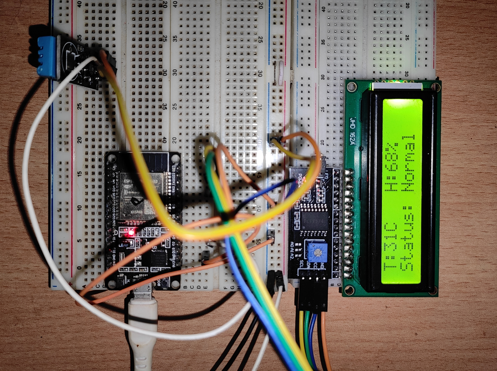
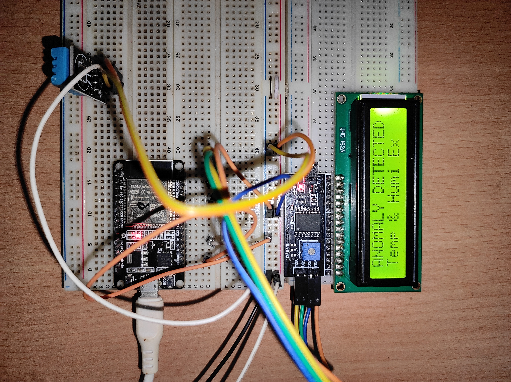
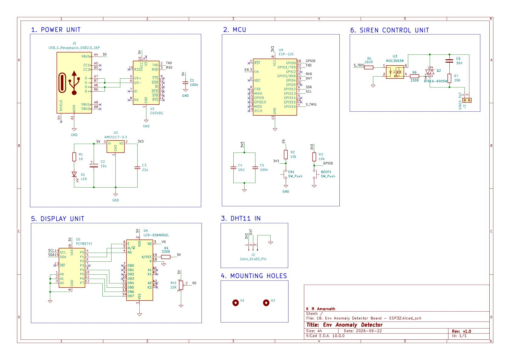
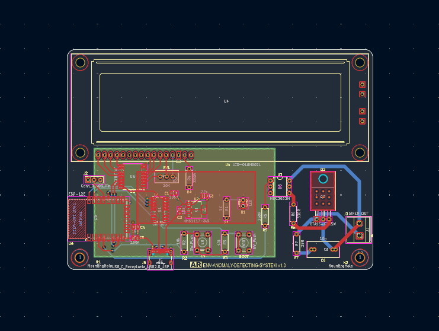
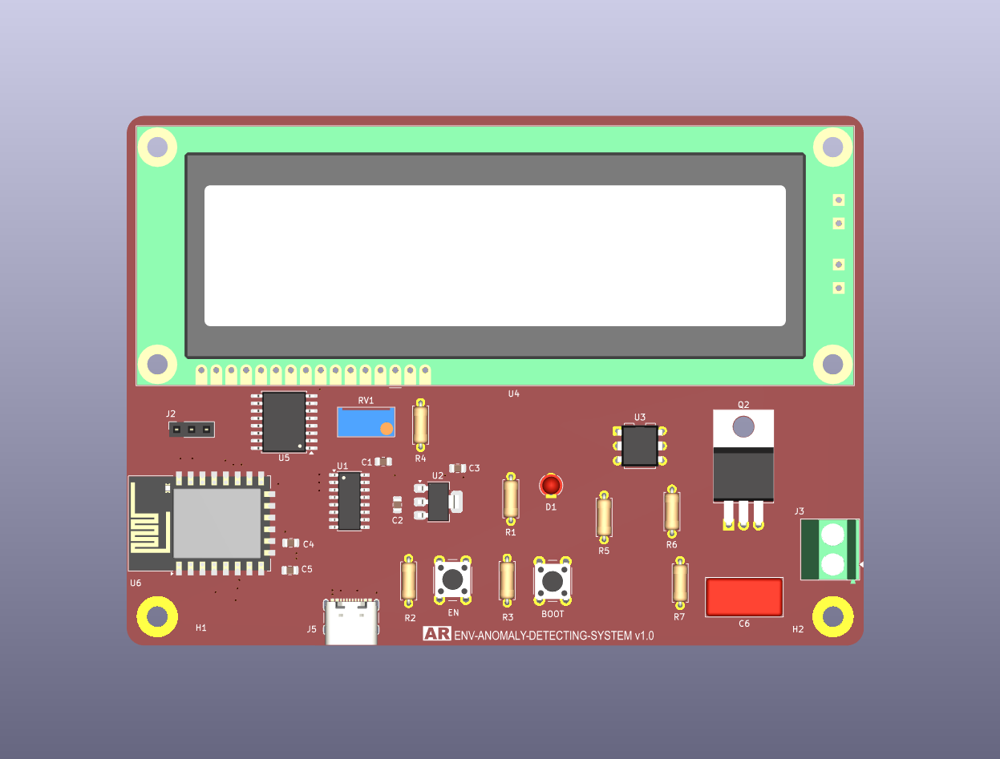
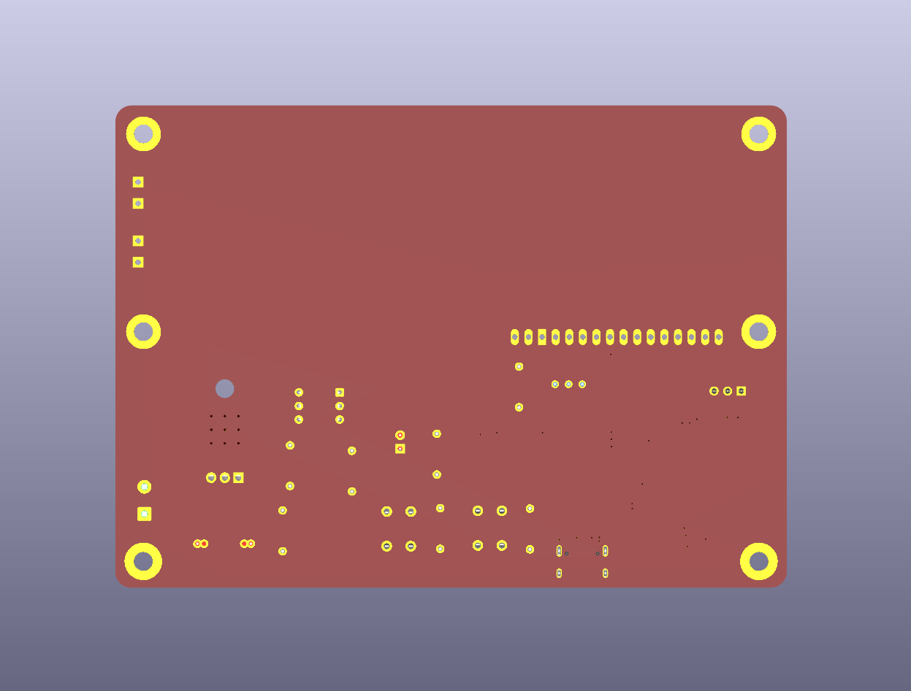
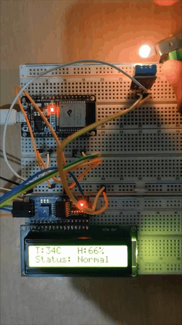

# Edge Anomaly Detector

An ultra-lightweight, deterministic **Statistical Edge Analytics** engine built with MicroPython for the ESP hardware platform.

This system performs real-time environmental condition monitoring, rate-of-change analysis, and 3-sigma boundary checking using a DHT11 sensor and an I2C display. Designed for edge deployments where real-time determination and zero cloud dependency are important.

---

## The Data Collection Project for Further Learning

The statistical thresholds (`μ ± 3σ` and maximum rate-of-change) implemented in this edge engine were calibrated using baseline historical data (`feeds.csv`) gathered from local ambient conditions.

- **Data Pipeline & Baseline Collection:** This  (`feeds.csv`) dataset was used to calibrate the statistical parameters used in this project and the details of the data collection are documented in a previous repository.
- **Reference Repository:** [Env Monitoring System - ESP32](https://github.com/kramarnath/env-monitoring-system-esp32)


> **Statistical note:** The `μ ± 3σ` values are used as empirical statistical boundaries derived from the baseline dataset. The dataset does not need to be perfectly normally distributed for these values to be calculated. However, the familiar 99.7% interpretation of ±3σ assumes an approximately normal distribution.

---

## System Overview (Working Demo)


---

## 📁 Project Structure

```text
## 📁 Project Structure

```text
.
├── docs
│   ├── code
│   │   ├── config.py
│   │   ├── anomaly_detector.py
│   │   ├── main.py
│   │   └── statistical_values.py
│   │
│   ├── prototype
│   │   ├── images
│   │   ├── schematics
│   │   └── working_demo.gif
│   │
│   └── pcb/
│       ├── schematic
│       ├── cu_layers
│       ├── 3d_render
│       └── bill_of_materials.csv
│
├── README.md
└── LICENSE
```

### Source Files

| File | Description |
|---|---|
| `config.py` | Stores the calibrated statistical thresholds |
| `anomaly_detector.py` | Statistical anomaly-detection engine |
| `main.py` | Main hardware loop, sensor reading, display, and alert control |
| `statistical_values.py` | To find the statistical thresholds from dataset |
| `bill_of_materials.csv` | Hardware component list |

---

# Prototype Using ESP32

## Prototype Setup

The system was initially prototyped using an ESP32 development board. The prototype was used to validate sensor acquisition, statistical anomaly detection, rate-of-change detection, LCD status display, and external alert triggering.

## Prototype Operation Demo


---

## Prototype Connections (ESP32 Pinout)

| Component | ESP32 Pin | Signal / Net | Function |
|---|---:|---|---|
| **DHT11 Data** | GPIO4 | `DHT` | Single-wire digital input |
| **I2C LCD (SDA)** | GPIO21 | `SDA` | I2C data line |
| **I2C LCD (SCL)** | GPIO22 | `SCL` | I2C clock line |
| **Power Supply** | 3.3V / GND | `VCC` / `GND` | System power |

---

## Working Description

During the prototyping phase on the ESP32, the firmware was written in MicroPython using an Object-Oriented Programming (OOP) model (`StatisticalAnomalyDetector`).

### 1. Calibrated 3-Sigma Boundary Checks

Live temperature and humidity readings are evaluated against statistical boundaries derived from historical baseline data.

```text
Lower Boundary = μ − 3σ

Upper Boundary = μ + 3σ
```

where:

- `μ` = baseline mean
- `σ` = baseline standard deviation

The system is calibrated in such a way that If a live value falls below the lower boundary(`μ − 3σ`) or above the upper boundary(`μ + 3σ`), the system flags a boundary anomaly.

### 2. Rate-of-Change Spike Capture

The system also evaluates the difference between consecutive one-minute samples.

```text
ΔT = |Tₖ − Tₖ₋₁|

ΔH = |Hₖ − Hₖ₋₁|
```

where:

- `Tₖ` = current temperature
- `Tₖ₋₁` = previous temperature
- `Hₖ` = current humidity
- `Hₖ₋₁` = previous humidity

The maximum observed change between consecutive baseline samples is used as the reference rate-of-change boundary in the (`config.py`) file.

This allows a sudden environmental spike to be detected even if the absolute temperature or humidity has not yet crossed its statistical boundary this type of sudden spikes may possibly be a fire or an electrical malfuction.

If an anomaly is detected, the 16×2 I2C display immediately updates to show the specific violation, such as:

```text
Anomaly detected
Temp Exceeded and etc
```
---

# Anomaly Detection Logic

```text
                 SENSOR READING
                       │
             ┌─────────┴─────────┐
             │                   │
       Boundary Check       Rate-of-Change
             │                   │
             └─────────┬─────────┘
                       │
                Anomaly Detected?
                       │
              ┌────────┴────────┐
              │                 │
             NO                YES
              │                 │
           NORMAL          ALERT OUTPUT
                                │
                         ┌──────┴──────┐
                         │             │
                      Display       Siren /
                      Warning       Indicator

The siren trigger circuit is only included in the pcb not in the breadboard prototype.
```
---

## LCD Status

The 16×2 I2C LCD provides real-time system information.

Example normal condition:

```text
T: 31.5C  H: 72%
Status: NORMAL
```

Example anomaly condition:

```text
T: 38.2C  H: 73%
ANOMALY DETECTED
```

Possible anomaly states include:

```text
Temp Exceeded
Humi Exceeded
Spike Detected
```

---

# Custom PCB Using ESP-12E

## Why ESP-12E Was Used Instead of ESP32

A 4 layer pcb prototype with ESP-12E was made using kicad.

A key milestone in this engineering lifecycle was right-sizing the processing hardware.

### 1. Initial Benchmarking

The initial approach considered using an Edge ML device with a TensorFlow Lite autoencoder for anomaly detection. However, after analyzing the available dataset, I found that it was relatively small and did not sufficiently represent the range of environmental conditions required for reliable anomaly detection.

For an ML-based anomaly detector, the training data needs to be representative of the conditions under which the system will operate. For example, a model trained primarily on summer data may classify legitimate rainy-season conditions as anomalous because those conditions were not adequately represented during training.

The available temperature data was also relatively discrete, and the dataset did not sufficiently cover different environmental conditions and seasonal variations. As a result, the ML approach did not provide sufficiently reliable results for the available dataset.

Therefore, I decided to use a statistical anomaly-detection approach instead of the TensorFlow Lite model.

### 2. Workload Optimization

The project was subsequently simplified to deterministic statistical edge analytics.

The final algorithm primarily performs:

- Sensor acquisition
- Arithmetic operations
- Statistical boundary comparisons
- Rate-of-change calculations
- LCD communication
- Alert output control

This substantially reduces the computational requirements compared with a neural-network-based implementation.

### 3. Hardware Right-Sizing

Using a dual-core 240 MHz ESP32 for simple statistical bounds would provide more processing capability than the final algorithm requires.

The production hardware was therefore deliberately downscaled to the cost-effective **ESP-12E (ESP8266)** module.

The result is a simpler and more cost-effective dedicated edge device.

---

# ESP-12E PCB Connections

| Peripheral Line | Schematic Net | ESP-12E Module Pin | ESP8266 GPIO | Description |
|---|---|---:|---:|---|
| **DHT11 Data** | `DHT` | Pin 19 | **GPIO4** | Single-wire digital input |
| **I2C Display (SDA)** | `SDA` | Pin 6 | **GPIO12** | Software I2C data line |
| **I2C Display (SCL)** | `SCL` | Pin 7 | **GPIO13** | Software I2C clock line |
| **Siren / Alert Output** | `TRIG` | Pin 4 | **GPIO16** | to Turn ON the Siren |
| **UART Flash/Debug TX** | `TXD` | Pin 22 | **GPIO1** | Serial transmit |
| **UART Flash/Debug RX** | `RXD` | Pin 21 | **GPIO3** | Serial receive |

---

## Boot-Strapping Circuit

To guarantee reliable SPI Flash boot on the bare ESP-12E module, the schematic incorporates the required biasing resistors.

| ESP8266 Pin | Bias / Connection | Purpose |
|---|---|---|
| **EN** | 10 kΩ pull-up | Chip enable |
| **RST** | 10 kΩ pull-up | Reset configuration |
| **GPIO0** | 10 kΩ pull-up + switch to GND | Serial flashing mode |

---

# Siren and Display Connections

## I2C Display Interface

The 16×2 HD44780 display with a PCF8574 I2C adapter is driven using MicroPython's `SoftI2C` interface at 100 kHz.

| ESP-12E GPIO | Signal | Display Function |
|---|---|---|
| GPIO12 | SDA | I2C data |
| GPIO13 | SCL | I2C clock |

Line 1 provides real-time sensor metrics, while Line 2 displays system health or anomaly information.

Example:

```text
T:31.5C H:72%
Status: Normal
```

---

## Siren Driver Circuit

GPIO16 serves as a dedicated **alert output**.

When an anomaly is detected:

```text
GPIO16 = HIGH
```

The signal can drive an external triac with optocoupler driver stage, which can then energize an external industrial hooter, siren, buzzer, warning lamp, or indicator.

When the anomaly condition clears:

```text
GPIO16 = LOW
```

> **Hardware note:** GPIO16 should not directly drive a high-power siren or industrial load.

---

# Statistical Calibration

The statistical calibration is performed using Python and Pandas.

## Temperature

```python
temp_mean = df["temperature"].mean()
temp_std = df["temperature"].std()

temp_min = temp_mean - (3 * temp_std)
temp_max = temp_mean + (3 * temp_std)
```

## Humidity

```python
humi_mean = df["humidity"].mean()
humi_std = df["humidity"].std()

humi_min = humi_mean - (3 * humi_std)
humi_max = humi_mean + (3 * humi_std)
```

## Maximum Rate-of-Change

Because the baseline readings are one minute apart:

```python
max_temp_roc = df["temperature"].diff().abs().max()
max_humi_roc = df["humidity"].diff().abs().max()
```

These values represent the maximum observed absolute change between consecutive one-minute samples.


---

# Edge Processing Pipeline

```text
             Historical Dataset
                    │
                    ▼
              Python / Pandas
                    │
                    ▼
          Statistical Calibration
                    │
          ┌─────────┴─────────┐
          │                   │
       μ ± 3σ             Max Δ/min
          │                   │
          └─────────┬─────────┘
                    │
                    ▼
              ESP-32/12E Config
                    │
                    ▼
               DHT11 Sensor
                    │
                    ▼
            Real-Time Analysis
                    │
          ┌─────────┴─────────┐
          │                   │
       Boundary             Spike
        Check              Detection
          │                   │
          └─────────┬─────────┘
                    │
                    ▼
             Normal / Anomaly
                    │
             ┌──────┴──────┐
             │             │
            LCD        Alert Output
```

---

# Hardware Artifacts & Media

## Prototype Image

<table>
  <tr>
    <td align="center"></td>
    <td align="center"></td>
  </tr>
</table>

---

## KiCad Schematic
<table>
  <tr>
    <td align="center"></td>
  </tr>
</table>

---

## KiCad PCB Layout
<table>
  <tr>
    <td align="center"></td>
  </tr>
</table>

---

## 3D PCB Render
<table>
  <tr>
    <td align="center"></td>
    <td align="center"></td>
  </tr>
</table>

---

# 🎥 Working Demonstration



The demonstration shows:

1. Real-time temperature and humidity measurement
2. LCD status updates
3. Statistical boundary evaluation
4. Rate-of-change detection
5. Anomaly indication
6. External alert activation

---

# Technologies Used

| Category | Technology |
|---|---|
| Microcontroller | ESP32 and ESP-12E / ESP8266 |
| Firmware | MicroPython |
| Sensor | DHT11 |
| Display | 16×2 LCD |
| Display Interface | I2C |
| Data Collection | MQTT/ThingSpeak |
| Data Analysis | Python |
| Data Processing | Pandas |
| Statistical Method | Mean, Standard Deviation, 3σ Boundaries |
| Rate-of-Change Analysis | Consecutive one-minute samples |
| PCB Design | KiCad |

---

# Conclusion

This project demonstrates a complete end-to-end embedded edge analytics workflow:

```text
Sensor Data Collection
        ↓
MQTT / ThingSpeak
        ↓
Historical Dataset
        ↓
Statistical Calibration
        ↓
ESP32 Prototype
        ↓
Algorithm Simplification
        ↓
ESP-12E Custom PCB
        ↓
Standalone Edge Anomaly Detector
```

By replacing a more computationally expensive neural-network approach with a deterministic statistical engine, the system performs real-time environmental anomaly detection with a lightweight computational workload.

The final system provides:

- Real-time temperature and humidity monitoring
- Statistical anomaly detection
- 3σ boundary-based alerting
- Rate-of-change spike detection
- Local edge processing
- Deterministic decision making
- Low computational complexity
- No cloud dependency during normal operation
- LCD-based status indication
- External hardware alert output
- Custom ESP-12E PCB implementation

The project demonstrates an important embedded engineering principle: **the processing hardware should be selected according to the actual computational requirements of the algorithm.**

The final ESP-12E implementation provides a compact, dedicated platform for environmental edge monitoring without requiring continuous cloud connectivity or a machine-learning inference engine.

---

## License

MIT License — see [LICENSE](LICENSE) for details.
